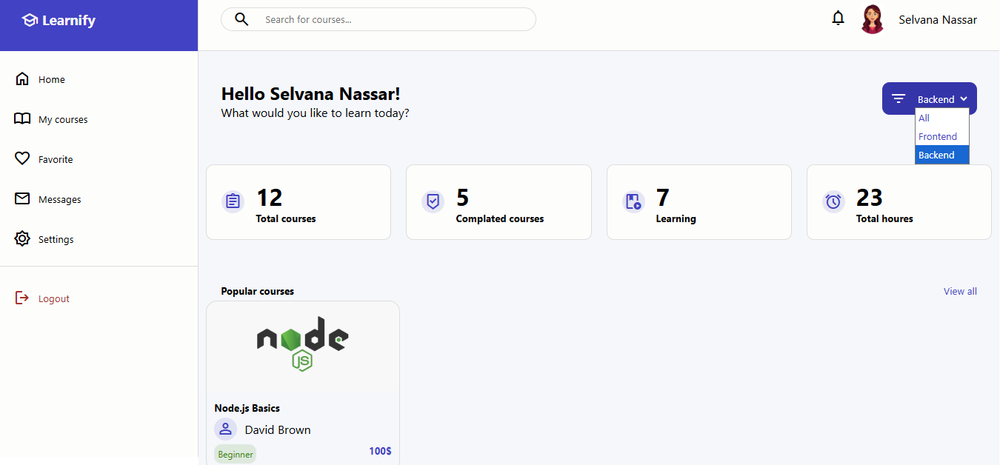
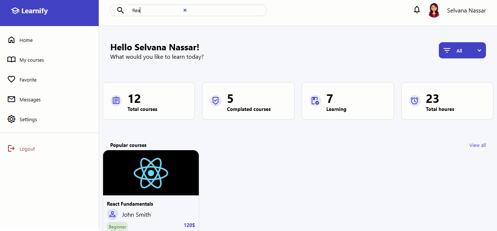

# 🎓 Learnify - E-learning platform

A modern React-based front-end application for browsing and exploring online courses.

---

  

⭐ This project was built to practice modern React development, responsive UI design, routing, and state management using Context API.

---

---

## 📌 About the project

This project is a modern front-end application built with React.
It simulates an online learning platform where users can browse, search for courses, filter categories, and view detailed course information.

---

## 🔗 Links

🚀 [Live Demo](https://learnify-react.vercel.app)

💻 [Source Code](https://github.com/SelvanaNassar/Learnify-react)

---

## 📸 Screenshots

### 💻 Desktop view

 
 
 
 
 
 

### 📱 Mobile view

 
 
 
 
 
 

### 🔍 Search & Filtering

 
 

---

## ✨ Features

- 🔐 User authentication simulation.
- 📚 Display available courses.
- 🔎 Search courses by title.
- 🏷️ Filter courses by category.
- 📄 Dynamic course details pages.
- 🔒 Protected routes using React Router.
- 🔔 User notifications with React Toastify.
- 📱 Fully responsive design for different screen sizes.

---

## 🛠️ Technologies 

### Frontend
- HTML5
- CSS3
- JavaScript (ES6+)
- React.js

### Routing & State management
- React Router DOM
- Context API

### Libraries & Tools
- React Toastify
- JSON Server

### Deployment
- Vercel

---

## 📂 Project Structure

│
├──  src/
│  ├── allComponents/          # Reusable React components
│  ├── allComponentsCSS/       # Component styles
│  ├── authContext/            # Authentication context
│  ├── privateRoute/           # Route protection
│  ├── layout/                 # Consistent layout component 
│  ├── App.js
│  ├── index.css
│  └──  index.js
│
├──  screenshots/              # screenshots
│  ├── Desktop view/
│  ├── Mobile view/
│  ├── search.png
│  └── filter.png 
│
├──  public/
│  ├── courses.json
│  └── images
└──  README.md

---

## 📌 Project scope

This project focuses on front-end development using React.
Authentication is simulated to demonstrate the user interface, routing, state management and responsive UI design.
No backend services or database are currently integrated.
No real user authentication is currently implemented.

---

## 🔮 Future improvements
 
- Add real authentication using Google and GitHub and real registration. 
- Connect the application to a backend API or database.
- Store user accounts securely.
- Add user profiles.
- Add course progress tracking.
- Add database integration.

---

## ⚙️ Installation

git clone [REPOSITORY_LINK](https://github.com/SelvanaNassar/Learnify-react.git)

cd Learnify-react

npm install

npm run start

---

## 📚 What I learned

Through this project, I practiced:

- Building reusable React components
- Managing state with React hooks
- Using React Router
- Organizing a React project structure
- Creating responsive layouts

---

## 👩‍💻 Author

ENG. Selvana Nassar

GitHub: [YOUR_LINK](https://github.com/SelvanaNassar)

LinkedIn: [YOUR_LINK](https://www.linkedin.com/in/selvana-nassar-a83538216)

Email: [selvananassar@gmail.com](mailto:selvananassar@gmail.com)